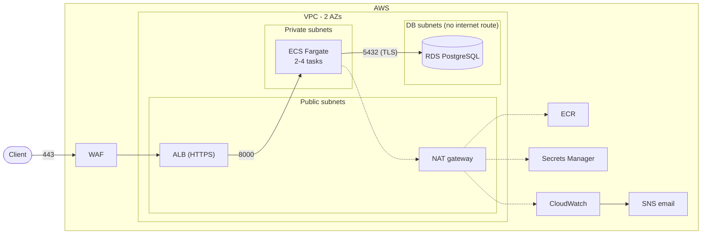

# Architecture

## Components

- **Load balancer:** an internet-facing ALB in two public subnets. HTTP redirects to HTTPS, which accepts TLS 1.2 and 1.3 only. AWS WAF is attached with the AWS managed rule sets (common, known bad inputs, SQLi, IP reputation) and a per-IP rate limit.
- **Application:** a FastAPI service on ECS Fargate in private subnets. It runs 2 tasks across both AZs and autoscales to 4 on CPU and request count. Deployments are rolling, with the ECS circuit breaker set to roll back.
- **Database:** RDS PostgreSQL 16 in subnets with no internet route. Storage is encrypted with KMS, SSL is enforced (`rds.force_ssl`), and backups are kept for 7 days. The master password is generated and stored by RDS in Secrets Manager.
- **Registry:** ECR with immutable tags and scan on push.

The service is a small REST API:

| Method | Path | |
|---|---|---|
| POST | `/v1/accounts` | create account |
| GET | `/v1/accounts/{id}/balance` | current balance |
| POST | `/v1/accounts/{id}/deposit` | deposit |
| POST | `/v1/accounts/{id}/withdraw` | withdraw, 409 if insufficient funds |
| GET | `/v1/accounts/{id}/transactions` | transaction history |

Amounts are stored as `NUMERIC(18,2)`. A deposit or withdrawal locks the account row (`SELECT ... FOR UPDATE`), updates the balance and writes a ledger row in one transaction. Concurrent withdrawals therefore can't overdraw an account, and a `CHECK (balance >= 0)` constraint backs this up in the database. An optional `Idempotency-Key` header makes retries safe.

The schema is managed with Alembic. The deploy pipeline runs `alembic upgrade head` as a one-off ECS task before updating the service.

## Security

- **Network:** security groups only allow internet → ALB on 80/443, ALB → app on 8000, and app → DB on 5432. Tasks have no public IPs, and the DB subnets have no route to the internet.
- **Access control:**
  - API requests need an `X-API-Key` header. The app only stores a SHA-256 hash of the key, in Secrets Manager.
  - IAM roles are scoped to this project's resources. The ECS task role has no permissions; the execution role can only pull this image, read its two secrets and write its log group.
  - GitHub Actions authenticates to AWS with OIDC, so no AWS keys are stored in GitHub. The plan role is read-only. The apply and deploy roles can only be assumed by jobs in the `production` environment, which requires manual approval.
- **Encryption at rest:** KMS customer-managed keys for RDS, Secrets Manager, ECR, SNS, SSM parameters, CloudWatch Logs and CloudTrail. Terraform state is in an encrypted, versioned S3 bucket.
- **Encryption in transit:** TLS from client to ALB. The app connects to RDS with `sslmode=verify-full` using the RDS CA bundle. Bucket policies deny non-TLS access.
- **Container:** the base image is pinned by digest and dependencies are hash-pinned. The image runs as a non-root user with a read-only root filesystem and all Linux capabilities dropped.
- **Audit:** CloudTrail, GuardDuty and VPC flow logs.

## Monitoring and logging

- The app writes JSON logs to CloudWatch Logs with a request ID on every line. Metric filters turn the log events into metrics: deposits, withdrawals, rejected withdrawals, auth failures and unhandled errors.
- The CloudWatch dashboard shows ALB traffic, errors and latency, target health, ECS CPU and memory, RDS metrics, WAF blocks and the business metrics.
- Alarms go to an SNS topic with an email subscription. They cover:
  - ALB and target 5xx errors
  - unhealthy targets
  - p95 latency
  - ECS CPU and memory
  - RDS CPU, storage and connections
  - auth failure spikes
  - application errors
  - WAF block spikes
- GuardDuty findings are also routed to the same topic.
- ALB access logs go to S3, and WAF logs go to CloudWatch Logs.

## CI/CD

GitHub Actions, four workflows:

- **`validation.yaml`** runs on every pull request, and is called by the other workflows. It only runs the parts that changed:
  - Always: gitleaks.
  - App changes: ruff, mypy and pytest against PostgreSQL; Bandit, Semgrep and pip-audit; image build with a Trivy scan.
  - Infra changes: terraform fmt and validate, tflint, Checkov and Trivy.
  - Semgrep, Trivy and Checkov results are uploaded to GitHub code scanning.
- **`build.yaml`** is called by `deploy.yaml`. It builds the image, scans it with Trivy (fails on fixable HIGH/CRITICAL), pushes it to ECR tagged with the commit SHA, signs it with cosign and attaches an SBOM. It uses a role that can only push to the ECR repository.
- **`deploy.yaml`** runs on merge to `main` when `app/` changes: validation, then build, then deploy. The deploy job needs manual approval (GitHub environment `production`), then registers a new task definition, runs the database migration, updates the ECS service and smoke-tests the live endpoint.
- **`terraform.yaml`** runs when `infra/` changes. Pull requests get the plan as a comment. On merge to `main` it runs validation, plans, waits for manual approval (environment `infra`) and applies.

Terraform owns the task definition; the deploy copies the latest revision and only changes the image. A change to the task definition in Terraform (for example a new environment variable) therefore takes effect on the next app deploy.

## Trade-offs

These choices keep the dev environment cheap (about $3–4 per day). All of them can be changed with variables:

- **Single NAT gateway:** one per AZ in production.
- **Single-AZ RDS:** set `db_multi_az = true`.
- **Self-signed certificate on the ALB when no domain is configured:** set `domain_name` and `route53_zone_id` to use ACM with DNS validation.
- **No VPC interface endpoints:** set `enable_interface_endpoints = true`.

RDS rotates the master password every 7 days. Tasks read the password at startup, so a rotation needs a forced redeploy (`aws ecs update-service --force-new-deployment`). In production the app would use IAM database authentication instead.
